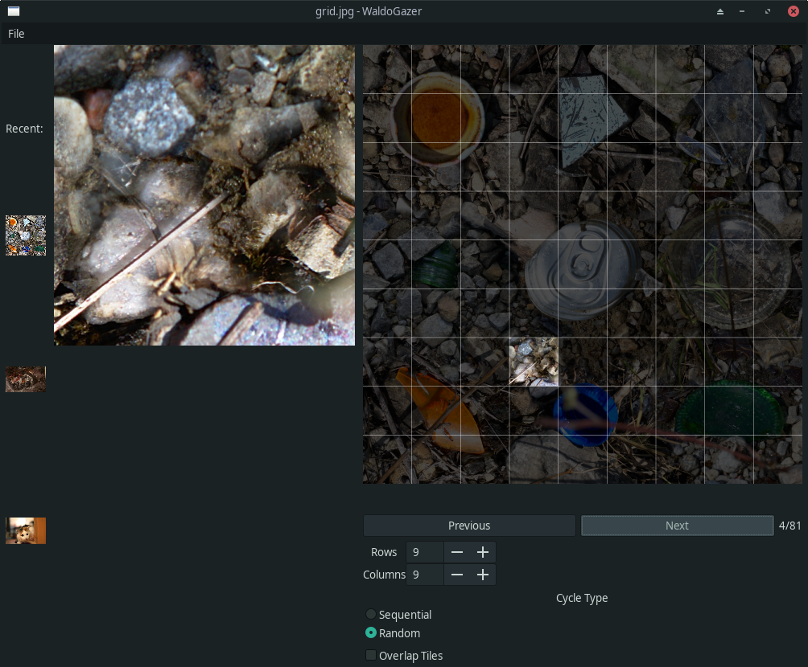

# WaldoGazer



Boost your speed at finding Waldo using this simple image viewing tool.

Waldogazer allows the user to minimize the bias they face when searching for something in an image.

When searching through an image for something, our brains tend to look at the same spots over and over again - never finding what it is we're looking for.

Using a tool like WaldoGazer, you can look at small pieces of an image in a systematic way, eliminating the bias that we face when presented with an image in its entirety.

## Running

Download the repository, and cd into it from the terminal.

run ```python main.py```

## Usage

To begin, click `File->Open...`
Select an image from your filesystem to load.

With the image loaded, you will see the image broken up into a grid - with one portion displayed on screen.

Using the `Rows` and `Columns` widgets, increase the number of rows and columns to match the level of detail you're seeking.

Using the `Next` and `Previous` buttons, navigate through the portions of the image, searching manually.

Use the `Cycle Mode` and `Overlap` options to change how the program behaves.

Enjoy!
